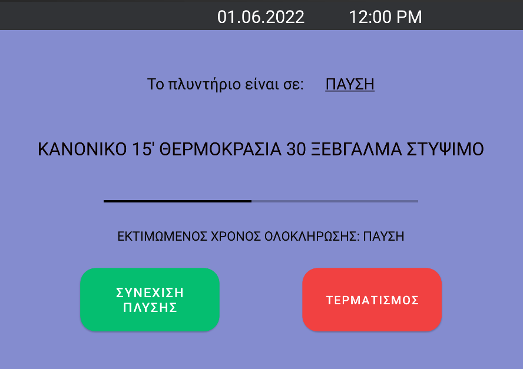

# Washing Machine UI

In this University project, we had to create an app to help people to use the washing machine called UNITED UWM-5010 much easier. The app is created for people who know the Greek language.

Our project follows the [Spiral model](https://en.wikipedia.org/wiki/Spiral_model).  
Youtube Video: [Link](https://youtu.be/egalI1cXn8c)

In the first cycle, we created some mocks using [Justinmind](https://www.justinmind.com) to give an idea about how the app should look in the future. We created questionnaires in order to ask for feedback.
We also used interviews in order to figure out how useful our interfaces are.

In the second cycle, we fixed some things that our users suggested through questionnaires and added more features in our mock-ups. We also used questionnaires in order to learn our users' opinion. We also asked our fellow students for an opinion. We asked them some technical questions, for example if they believe that our app will aid the user to swiftly complete their goals or if the UI is visually pleasing and simple.

Finally, in the 3rd cycle we create our Android app using Android Studio. We created an app which has a simple UI for every user regardless age with explaining buttons and instructions. The user can choose the program they want, start the laundering, pause the program or cancel the procedure at all without any problems. While the laundering takes place, a progress bar informs the user about its status. Information messages provided in every step. The user can also schedule the laundering with the program they want in date and time they want. Moreover, the user can cancel the scheduling laundering just by a button. An important feature our app has is the voice help which repeats the actions that user chooses every moment. When the icon in the home page does not have the line in the middle and is pressed, the feature is on. Otherwise, the feature is off.

We used the Nexus 9 Emulator for Android 6.0 and newer and as for the API, we used API 23.

## Home Page

## Available Programs

## Scheduling Laundering

## Laundering

## Pause

## Cancel Confirmation

## Cancel successfully 

## Laundering ended successfully 

## Settings

## Voice helper on and off -- gif

